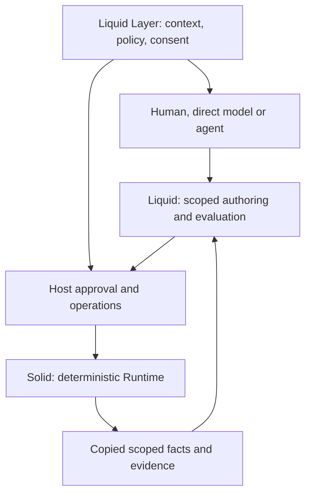

# Liquid Concepts and Architecture v0.5

**Design revision:** 6–7 September 2026. This document explains the proposed
Stage 2 architecture; it does not activate implementation. Operational scope
lives in [AGENTS.md](AGENTS.md), status in [tracking](DEVELOPMENT_TRACKING.md),
and executable requirements in [the roadmap and linked specs](docs/LIQUID_STAGE2_PLAN.md).

## Purpose and layers

Liquid Layer is the final adaptive smart-environment application intended to
reduce cognitive friction for neurodivergent people. That purpose motivates
the architecture; engineering fixtures do not establish benefit for a person.

Solid is the deterministic foundation. It owns World state, behavior access,
immutable intents, ordered execution, resolution, effect delivery, validated
observations, lifecycle Lua, simulation and replay. Its v0.1 release and later
hardening evidence must be read at their recorded revisions.

Liquid is the reusable authoring and control layer. It turns host-selected
capabilities into a bounded authoring contract, evaluates exact proposals,
exposes scoped truth, and permits explicit host-approved operations. It does
not become a second Runtime or maintain competing component/intent state.

Liquid Layer owns user/environment context, consent, model choice/invocation,
agent memory, hardware, application meaning and human studies. Direct versus
agent execution and local versus hosted models are independent choices.



Models remain outside frame execution. Already approved behavior keeps running
when every model is unavailable. Provider structured output helps generation;
it cannot grant permission, validate arbitrary codecs or authorize installation.

## Behavior, source and intent are different identities

A Solid behavior owns intents and receives component access. Systems process
its components. An external agent need not be a Solid behavior or carry an
Agent component; it can simply consume Liquid's authoring surface.

Lua source is executable behavior data. Each lifecycle execution uses a fresh
bounded VM; persistent state lives in ordinary serializable components.
The [existing lifecycle contract](docs/LIFECYCLE_SCRIPTING.md) is authoritative
for released execution. The L2 specification proposes an additive selection
mode so multiple behaviors can use distinct script components.

Intent content is immutable. A persistent intent can remain alive while losing
selection and win again after a competitor disappears. Until-time is monotonic
intent metadata. Explicit cancellation destroys an intent; it does not mutate it.

```text
live intent != selected intent != dispatched command
            != accepted report != authoritative observed state
```

For example, FocusSupport's persistent brightness 70 may lose to FollowUser's
higher-priority 0. The original 70 intent remains live. The light is known to be
0 only after validated feedback; cancelling FollowUser does not recreate 70.
Inspection reports these facts rather than waking an agent for every resolver
change. Whether a change deserves inference is application policy.

## From scope to approved behavior

1. The trusted host selects a scope of named targets and access modes.
2. The runner derives copied capability metadata and permitted readable values.
3. An external author submits exact source under that scope revision.
4. Registered isolated scenarios execute it through real Solid mechanics.
5. The host reviews the exact artifact/evidence and current-context policy.
6. A bounded operation installs, replaces or stops a managed behavior.

Prospective scope does not create a live behavior. A manifest is descriptive
data, not executable authority. Target handles, native callbacks and caller
identity remain private to the trusted host. Every boundary rechecks ownership,
revision and target liveness, including removal/recreation under the same name.

Lua read and write codecs are independent. L0 describes both directions, exact
Integer/Number kinds and actual Lua construction constraints. Literal `{}` is
an Object; host-provided arrays carry a private marker. No renderer may invent
empty-array syntax or infer permission from a readable value.

Evaluation freezes explicit scenario inputs and proves only those assertions.
It is not a generic clone of current World, a universal proof, or permission to
activate. Source repair creates a new immutable proposal. Approval binds the
host-held exact source/scope/evaluation, not an untrusted hash alone.

## Revision, stopping and failure

L5 proposes a stable Liquid managed identity across fresh Solid behavior
instances. Replacement retires the old behavior and all its intents before
making the successor runnable. Old losing persistent intents cannot survive
unnoticed. New lifecycle state starts fresh; shared component values persist
unless an explicitly approved behavior changes them through ordinary intents.

Topology operations can partially commit when trusted callbacks fail. Liquid
records that outcome and requires host intervention; it does not promise a
World transaction that does not exist. No operation can undo an external
command already sent. Stopping removes behavior authority, not physical history.

Scope revocation invalidates future authoring operations. Stopping a currently
active behavior is a separate explicit host decision. Model failure or loss of
conversation memory does not automatically cancel deterministic behavior.

## Inspection, evidence and privacy

Current state and last-frame evidence are separate sections. A selection from
an earlier frame is not relabeled as today's winner after between-frame
changes. Hidden competitors stay hidden; missing authoritative observation is
unknown, not the desired state. Public views contain copies, never raw slots,
mutable pointers, registries, native routes or adapter credentials.

Solid evidence answers what execution did and observed. The proposed Liquid
journal correlates authoring, evaluation, approval and operation artifacts.
Its first implementation is bounded and in-memory; it is not durable recovery,
permanent audit or tamper evidence. Solid v1 retention also has finite-history
limits documented in [the event contract](docs/EVENT_FORMAT_V1.md).

Trusted registration descriptions are bounded text. User/sensor/model strings
remain structured data. No conversation/provider credentials are retained by
default. Host-context predicates and consent policy belong to the application.

## Transport and packaging

The native semantic API precedes MCP. L6 proposes a local stdio Python SDK
adapter over a bounded C++ host process. It exposes authoring/evaluation/read
tools only; approval and live mutations stay host-only. Hermes is one possible
external client, not a dependency or the contract owner. Remote networking and
OAuth are deferred, rather than incompletely specified as part of local use.

L0 extends existing `Liquid::Lua`. L1 proposes opt-in `Liquid::Authoring`, with
Core/Lua/Simulation dependencies and no model provider. Current installations
still export only the three existing components unless a future implementation
enables Authoring. The optional transport and Solid Scope remain uninstalled
development tools. No Scope split or new ABI promise is part of Stage 2.

## Design boundaries and progression

Reject model calls inside Runtime, a second capability registry, full JSON
Schema as the native Lua type system, implicit source rewriting, optimistic
physical truth, raw remote mutators and LLM conflict arbitration.

Defer model-provider integration, semantic-trigger frameworks, new behavior
languages, durable adaptive recovery, real hardware and user studies until
separate evidence establishes their need. The complete L0–L6 specs are a
bounded sequence, not permission to expand into those areas.

Use the authority rule in AGENTS.md. Claude implements an activated step,
tests it, and gives evidence to Codex; the owner approves progression. A code
finding can justify changing this design, but that correction must be explicit
and reflected in the specifications before further implementation.
