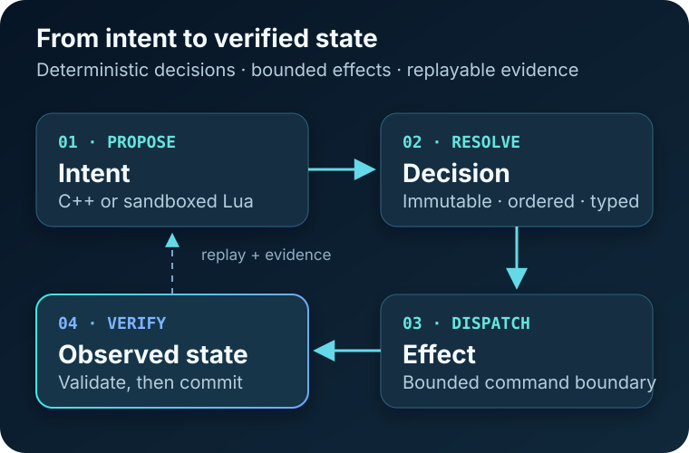

# Liquid

**A deterministic C++20 runtime for adaptive environments—designed to turn intent into verified, replayable state changes.**

[](https://github.com/RaulFonseca002/tcc/actions/workflows/ci.yml)
[](https://en.cppreference.com/w/cpp/20)
[](https://cmake.org/)
[](LICENSE-NOTICE.md)

[Get started](#build-and-test) · [Understand the runtime](#how-solid-works) · [Integrate](#use-liquid-from-another-project) · [Read the contracts](#documentation-map)



> [!IMPORTANT]
> **Current status:** the Solid v0.1.0 headless implementation is complete through S5. Solid Scope synchronization and remote S7 release gates remain, so this repository is **not yet a release declaration**.

| Deterministic core | Evidence-first effects | Portable package |
| --- | --- | --- |
| Immutable intents, ordered phases, world-bound handles | Desired, commanded, reported, and observed state stay distinct | Static `Core`, `Lua`, and `Simulation` CMake targets |

## Why Liquid exists

Adaptive environments need more than a decision engine. They need a trustworthy boundary between **what software wants** and **what the environment actually did**.

Liquid separates that loop into two layers:

- **Solid** — the completed deterministic foundation: state, intents, resolution, effects, feedback, event records, replay, and simulation.
- **Liquid** — the planned adaptive layer that will generate or modify Solid behavior without bypassing Solid's safety and evidence contracts.

The final application, **Liquid Layer**, will use this runtime to reduce cognitive friction in smart environments for neurodivergent people. Real hardware, MQTT, voice, biosignals, and LLM integration are intentionally outside the v0.1 boundary.

## How Solid works

```text
trusted C++ or sandboxed Lua behavior
    → immutable intent proposal
    → deterministic phase execution and conflict resolution
    → typed effect command through a bounded adapter
    → applied / rejected / failed / pending report
    → validation on the Runtime-owning thread
    → authoritative observed state
    → durable evidence and replay
```

A selected value is only a **desire**. Solid updates externally controlled state only after a correlated, validated report or revisioned observation proves what happened.

### Core guarantees

- **Deterministic resolution** — intents are immutable after creation and resolve through explicit lifetime, priority, and ordering rules.
- **No false physical truth** — selected intent, dispatched command, reported result, and observed state are different types and evidence stages.
- **Bounded authority** — adapters receive commands, not `World`, registries, component slots, or mutation access.
- **Replayable evidence** — memory and file event stores support projection replay and host-assisted verification.
- **Controlled scripting** — Lua runs in fresh, capability-limited sandboxes with transactional proposal commits.
- **Portable verification** — CI defines strict Release builds for GCC, Clang, AppleClang, and MSVC, plus sanitizer, coverage, and consumer-package gates.

## Build and test

### Requirements

- CMake 3.20 or newer
- A C++20 compiler:
  - GCC or Clang on Linux
  - AppleClang on macOS
  - MSVC on Windows

### Strict Release build

```sh
git clone https://github.com/RaulFonseca002/tcc.git
cd tcc

cmake -S . -B build \
    -DCMAKE_BUILD_TYPE=Release \
    -DBUILD_TESTING=ON \
    -DLIQUID_ENABLE_STRICT_WARNINGS=ON \
    -DLIQUID_WARNINGS_AS_ERRORS=ON
cmake --build build --config Release
ctest --test-dir build -C Release --output-on-failure
```

The checkout vendors the official Catch2 v3.8.1 amalgamation and Lua 5.4.8, so the default test build does not need to download either dependency. Their provenance and integration boundaries are documented under [`third_party/`](third_party/).

## Use Liquid from another project

Liquid is split into three static targets so consumers pay only for the boundary they need:

| Component | CMake target | Use it for |
| --- | --- | --- |
| Core | `Liquid::Core` | Values, world/runtime APIs, effects, event stores, and replay |
| Lua | `Liquid::Lua` | Capability-bounded Lua behavior execution |
| Simulation | `Liquid::Simulation` | In-memory adapters and deterministic scenarios |

### Source-tree integration

```cmake
set(BUILD_TESTING OFF CACHE BOOL "" FORCE)
add_subdirectory(path/to/liquid)

target_link_libraries(my_app PRIVATE Liquid::Core)
```

### Installed-package integration

```cmake
find_package(Liquid 0.1 CONFIG REQUIRED COMPONENTS Core)
target_link_libraries(my_app PRIVATE Liquid::Core)
```

Core-only consumers can disable both optional components:

```sh
cmake -S . -B build/core-only \
    -DLIQUID_BUILD_LUA=OFF \
    -DLIQUID_BUILD_SIMULATION=OFF
```

Runnable source-tree and installed-package consumers cover all three exported targets in [`examples/`](examples/). See the [integration guide](docs/INTEGRATION_GUIDE.md) for the complete contract.

## Verification profiles

The same CMake switches power local checks and CI:

```sh
# AddressSanitizer + UndefinedBehaviorSanitizer
cmake -S . -B build/asan -DLIQUID_ENABLE_SANITIZERS=ON

# ThreadSanitizer — GCC or Clang
cmake -S . -B build/tsan -DLIQUID_ENABLE_THREAD_SANITIZER=ON

# Core coverage — requires gcovr
cmake -S . -B build/coverage \
    -DLIQUID_BUILD_LUA=OFF \
    -DLIQUID_BUILD_SIMULATION=OFF \
    -DLIQUID_ENABLE_COVERAGE=ON
cmake --build build/coverage --target coverage
```

The coverage target enforces at least **90% line** and **80% branch** coverage over `include/liquid` and `src`. CI also installs the package and compiles independent consumers to validate the exported CMake surface.

## Architecture at a glance

| Boundary | Responsibility |
| --- | --- |
| `World` | Public state and behavior/component lifecycle |
| `Runtime` | Owner-thread frame phases, resolution, dispatch, feedback, and evidence |
| `EffectAdapter` | Narrow command transport without world mutation authority |
| `EventStore` | Durable or in-memory runtime records |
| Replay | Projection and host-assisted verification from recorded evidence |
| Lua | Fresh sandbox snapshots and allowlisted proposal capabilities |

Runtime state is confined to its owner thread. Only the bounded feedback sender is intended for concurrent producers. Returned component references are short-lived borrows; mutation uses transactional update or replacement APIs.

## Documentation map

### Start here

- [Public API](docs/PUBLIC_API.md) — supported symbols and ownership rules
- [Integration guide](docs/INTEGRATION_GUIDE.md) — source-tree and installed-package consumers
- [Support boundaries](docs/SUPPORT.md) — supported platforms and explicit non-goals
- [Compatibility policy](docs/COMPATIBILITY.md) — pre-1.0 source and event-format guarantees

### Runtime contracts

- [Adapter contract](docs/ADAPTER_CONTRACT.md) and [adapter guide](docs/ADAPTER_GUIDE.md)
- [Lifecycle scripting](docs/LIFECYCLE_SCRIPTING.md)
- [Event format v1](docs/EVENT_FORMAT_V1.md) and [file-store guide](docs/FILE_FORMAT_GUIDE.md)
- [Replay contract](docs/REPLAY.md) and [replay operations](docs/REPLAY_GUIDE.md)
- [Threading model](docs/THREADING.md) and [security boundary](docs/SECURITY_BOUNDARY.md)

### Project evidence

- [Solid completion audit](COMPLETE_SOLID.md)
- [Traceability matrix](docs/TRACEABILITY.md)
- [Development tracking](DEVELOPMENT_TRACKING.md)
- [Changelog](CHANGELOG.md)

## Security and support boundaries

Solid is an in-process framework, not a sandbox for hostile native host code. Hosts, adapters, codecs, and systems are trusted integration code. The Lua boundary is capability-based and bounded, while event decoders validate size, depth, UTF-8, finite-number, version, and sequence limits before allocation or mutation.

The v0.1 file store detects accidental corruption with CRC32C; it does **not** provide encryption, authentication, or tamper evidence. Network filesystems, multiple writers, shared-library ABI stability, and hostile native plugins are unsupported.

Read [SECURITY_BOUNDARY.md](docs/SECURITY_BOUNDARY.md) before integrating external adapters or persisted event files.

## License

Copyright is reserved by the repository owner. No license is granted for Liquid or Solid beyond owner-controlled repositories and projects unless separate written permission is provided.

See [LICENSE-NOTICE.md](LICENSE-NOTICE.md) and [THIRD_PARTY_NOTICES.md](THIRD_PARTY_NOTICES.md) for the exact terms.
